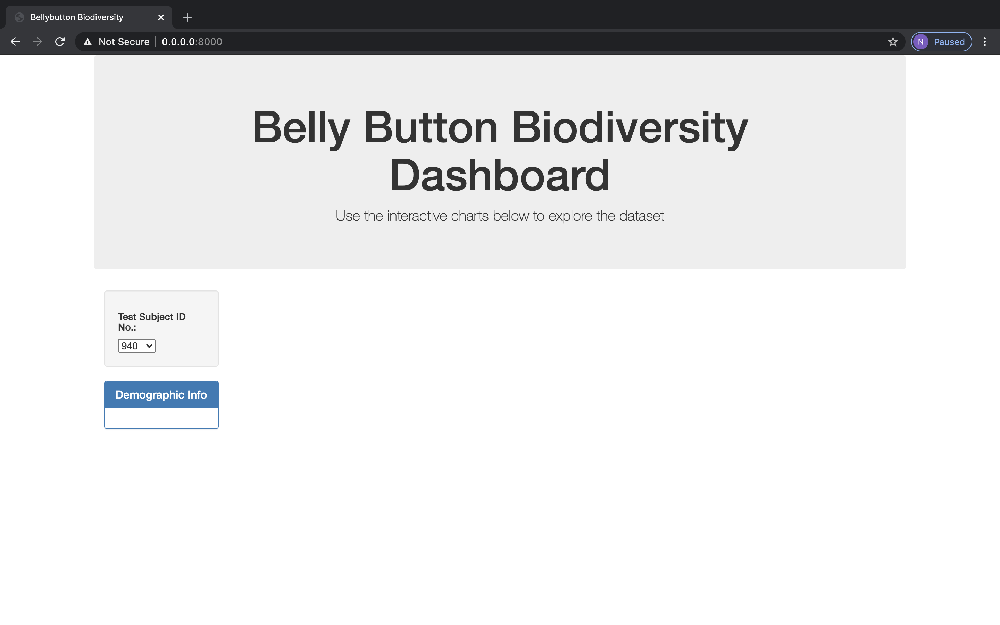
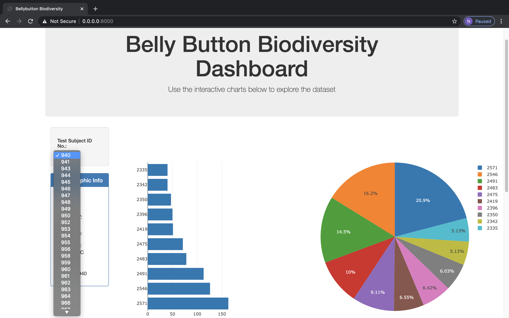
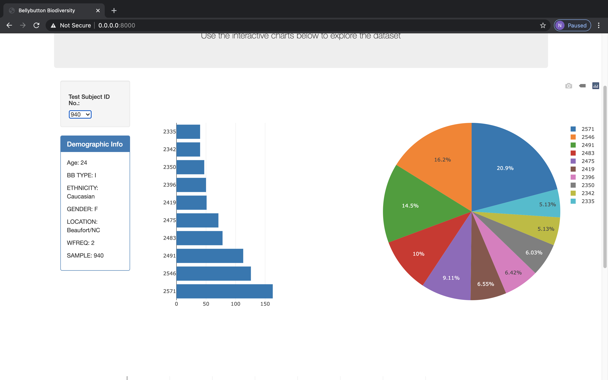
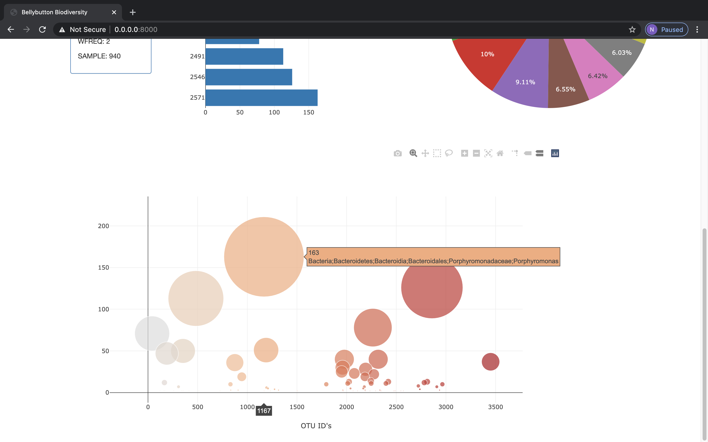

#Belly Button Biodiversity

Using the Belly Button Biodiversity dataset, the dashboard allows users to easily explore the available informtion of microbes that colonize the human navel.

The page has not been deployed yet, but can be accessed using a local server accessed through your terminal.

When first loading the page, it loads without any visualizations. They don't show up until you select one from the drop down.

When you do, it looks something like this.

